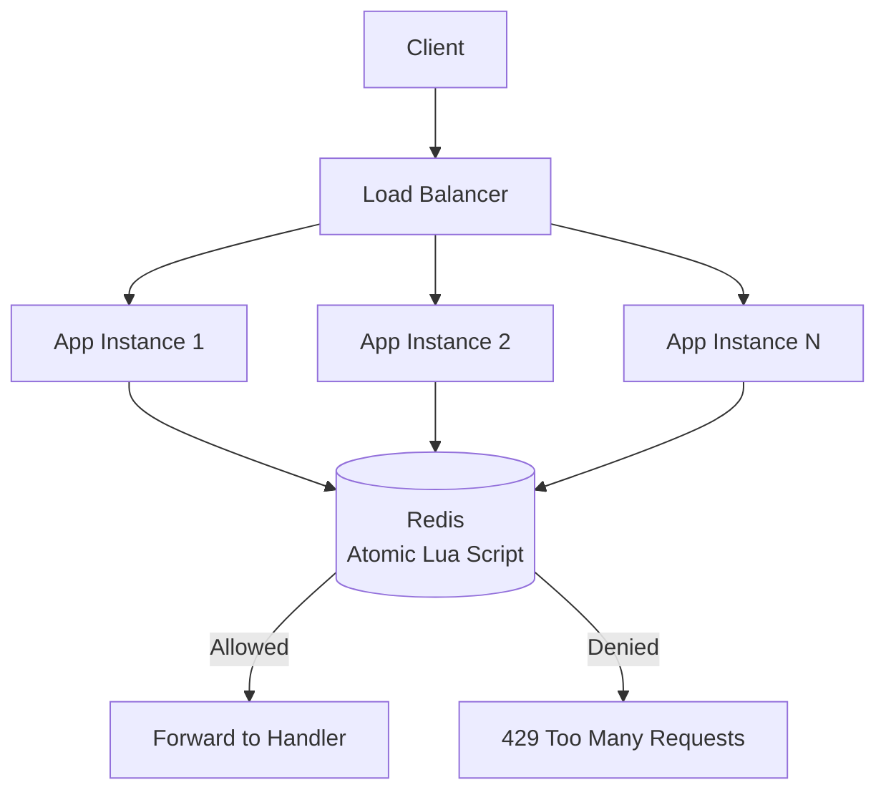

# Distributed Rate Limiter (.NET 10)

A distributed, Redis-backed rate limiting library and middleware for .NET 10, supporting multiple limiting algorithms with atomic, race-condition-free enforcement across horizontally scaled instances.

## Table of contents

- [Overview](#overview)
- [Features](#features)
- [Architecture](#architecture)
- [Design decisions](#design-decisions)
- [Algorithms](#algorithms)
- [Redis key design](#redis-key-design)
- [Request flow](#request-flow)
- [Failure handling](#failure-handling)
- [Tech stack](#tech-stack)
- [Getting started](#getting-started)
- [API reference](#api-reference)
- [Benchmarks](#benchmarks)
- [Project structure](#project-structure)
- [Future improvements](#future-improvements)

## Overview

Most rate limiter tutorials use a single in-memory counter, which silently breaks the moment you run more than one instance behind a load balancer — each instance thinks it has the full quota to give away. This project solves that with a shared Redis store and atomic Lua scripts, so the limit holds true regardless of how many app instances are running.

## Features

- Three pluggable rate limiting algorithms: Fixed Window, Sliding Window Counter, Token Bucket
- Distributed, atomic enforcement via Redis + Lua scripts (no race conditions across instances)
- .NET 10 middleware — drop into any minimal API with per-route/per-client configuration
- Standard rate limit response headers (`X-RateLimit-Remaining`, `Retry-After`)
- `/metrics` endpoint exposing allowed vs. rejected request counts
- Load tested with k6 across multiple replicas behind a load balancer

## Architecture



App instances are stateless — they hold no counters in memory. Redis is the single source of truth for rate limit state, shared across every instance, so the limit is enforced consistently no matter which instance a request lands on.

## Design decisions

**Why Redis + Lua scripts, not application-level check-then-increment**

A naive "GET counter → check → INCR" from application code has a race condition: two instances can both read the same value before either writes back, letting clients burst past the limit under concurrent load. Running the check-and-increment as a single Lua script makes it atomic on Redis's single-threaded event loop — no interleaving is possible regardless of how many instances call it concurrently.

**Stateless app instances**

Keeping all rate-limit state out of the app process is what makes horizontal scaling safe. Any instance can serve any request without needing sticky sessions or in-memory sync between replicas.

## Algorithms

| Algorithm | Behavior | Weakness | Best for |
|---|---|---|---|
| Fixed Window | Simple counter reset every interval | Allows up to 2x burst at window boundaries | Simplicity over precision |
| Sliding Window Counter | Weights previous + current window by time elapsed | Approximate, not exact | Balance of accuracy and low memory overhead |
| Token Bucket | Tokens refill at a steady rate; requests consume tokens | Requires tracking last-refill timestamp | APIs that need to tolerate short, legitimate bursts |

## Redis key design

```
Key:    ratelimit:{clientId}:{route}
TTL:    matches the window size (e.g. 60s) so stale keys self-expire
Value:  Fixed/Sliding Window → integer counter
        Token Bucket → hash { tokens, lastRefillTimestamp }
```

## Request flow

1. Client request hits the load balancer, routed to any app instance
2. Middleware extracts a client identifier (API key, user ID, or IP) and the target route
3. Middleware invokes the Redis Lua script for the configured algorithm against key `ratelimit:{clientId}:{route}`
4. Redis atomically checks and updates state, returning allow/deny plus remaining quota
5. **Allowed** → request forwarded to the handler; response includes `X-RateLimit-Remaining`
6. **Denied** → middleware short-circuits with `429`, includes `Retry-After`
7. `/metrics` counters increment for allowed vs. rejected requests

## Failure handling

If Redis becomes unavailable, the limiter has two options:

- **Fail open** — allow all requests through. Preserves API availability but temporarily removes protection.
- **Fail closed** — reject all requests. Protects downstream systems but turns a Redis blip into a full outage.

**Decision:** _TODO — document which mode this implementation uses and why once built._

## Tech stack

- .NET 10 (minimal API + middleware)
- Redis (state store, Lua scripting)
- Docker Compose (local multi-instance setup)
- k6 (load testing)

## Getting started

```bash
# TODO: fill in once scaffolding is complete
git clone <repo-url>
cd rate-limiter
docker compose up
```

Prerequisites: .NET 10 SDK, Docker

## API reference

| Endpoint | Description |
|---|---|
| `GET /demo` | Example endpoint protected by the rate limiter middleware |
| `GET /metrics` | Returns allowed vs. rejected request counts |

**Response headers on limited routes**

| Header | Description |
|---|---|
| `X-RateLimit-Limit` | Configured limit for the client/route |
| `X-RateLimit-Remaining` | Requests remaining in the current window |
| `Retry-After` | Seconds until the client can retry (on 429 only) |

## Benchmarks

_TODO — fill in after load testing (Week 2)._

| Scenario | Replicas | Throughput (req/s) | p50 latency | p95 latency | p99 latency |
|---|---|---|---|---|---|
| Sustained load | | | | | |
| Burst load | | | | | |

## Project structure

```
# TODO: fill in once scaffolding is complete
src/
  RateLimiter.Core/       # algorithm implementations, strategy interface
  RateLimiter.Middleware/ # .NET middleware integration
  RateLimiter.Demo/       # demo API using the middleware
tests/
docker-compose.yml
```

## Future improvements

- Redis Cluster for high availability (remove single point of failure)
- Local in-memory caching layer with periodic sync, trading strict accuracy for lower latency
- Per-client dynamic limit configuration via an admin API
